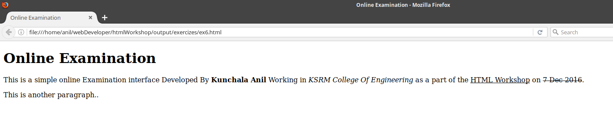

```
This is the reference Document for HTML Workshop conducted in KSRM College Of Engineering
Author : Kunchala Anil
Email : anilkunchalaece@gmail.com
```

# **HTML Introduction**

What is HTML ?<br>
HTML [HYPER TEXT MARKUP LANGUAGE] is language for Specifying how text and graphics appear on the webpage<br>

**Your First Webpage**<br>
Open your favourate Text editor and type<br>

```
Hello World
```

and save it as _helloWorld**.html**_<br>
Dont forget the .html extension

and open the Doument with firefox or chrome. it will display something like This 

Well.. eventhough browser able to render it without proper markup<br>
Before moving on we need to understand how browser understand input file<br>
go to the developer console by **pressing F12** then you can see something like This 

if you see clearly you can see that.. eventhough you didnt added any markup...<br>
Web browser addded it for you.. it is quite forgiving sometimes....

--------------------------------------------------------------------------------

**Simple HTML Document**
--
So.. the proper form of html Document is

```html
<!DOCTYPE html>
<html>
  <head>
  </head>
  <body>
    Hello World
  </body>
</html>
```

Now you are wondering what are those weird angular brackets with names in it..

from MDN

> HTML is not a programming language; it is a markup language, >and is used to tell your browser how to display the webpages you visit HTML consists of a series of elements, which you use to enclose, or wrap, different parts of the content to make it appear a certain way, or act a certain way

If to Explain:

```
The <html> element is the root element of an HTML page
    The <head> element contains meta information about the document
    The <body> element contains the visible page content
and The <!DOCTYPE html> declaration defines this document to be HTML5
```

so whatever we wanted to display in the **webpage** we need to put into the **body element**. And whatever the browser required to _understand our webpage_ it goes to the _Head Element_.

By the End of Workshop we are going to created three Three Webpages those are


page 1 : Index Page

<br>


page 2 : Login Page

<br>


page 3 : Test Page

<br>
Ok.. We are gonna Implement them Step by Step<br>
So If we look at the Index Page<br>
In the webpage some text is displaying.. so lets modify the helloworld example to disply the first two lines.

```html
<!-- ex1.html -->
<html>
  <head>
 </head>
 <body>
   Online Examination
   This is a simple online Examination interface Developed By Kunchala Anil Working in KSRM College Of Engineering as a part of the HTML Workshop on 7 Dec 2016.
 </body>
```

The output is 

In the display there are two things to be fixed

1. we wanted a heading in the page
2. Heading has to be separated from below text

**Headings in HTML**

Headings are defined with the h1 to h6 tags. There are six heading elements h1, h2, h3, h4, h5, and h6. Each element represents a different level of content in the document
```
<h1> represents the main heading,<br>
<h2>represents subheadings,<br>
<h3>represents sub-subheadings, and so on. so update our code to display heading
```
Modify our code to inlude a Heading

```html
 <!-- ex2.html -->
 <!doctype html>
  <html>
    <head>
   </head>
   <body>
     <h1>Online Examination</h1>
      This is a simple online Examination interface Developed By Kunchala Anil Working in KSRM College Of Engineering as a part of the HTML Workshop on 7 Dec 2016
    </body>
  </html>
  ```
   save it as ex2.html and open it with webbrowser. you will get
   
   Looks like we got what we wanted... But for Practice if you want to add some more text to the original text in another paragraph.. like This
   ```html
   <!-- ex3.html -->
    <!doctype html>
     <html>
      <head>
       </head>
      <body>
         <h1>Online Examination</h1>
          This is a simple online Examination interface Developed By Kunchala Anil Working in KSRM College Of Engineering as a part of the HTML Workshop on 7 Dec 2016.

           This is another paragraph..
        </body>
       </html>
  ```
  Save it and and reload the webpage... and the output looks like
  
  Insted of starting on another paragraph.. webpage appended all content in one line.. so to tell the browser to disply the content in another paragrah we use p tag.
   **Paragraph**
    --
```
 <p> element defines a paragraph

 ```

<p>
With HTML, you cannot change the output by adding extra spaces or extra lines in your HTML code. The browser will remove any extra spaces and extra lines when the page is displayed
so if we want to display them separate paragraph we can we use p tag.
<br>
the modified code
</p>


```html
<!-- ex4.html -->
<!doctype html>
<html>
 <head>
 </head>
 <body>
   <h1>Online Examination</h1>
   <p>This is a simple online Examination interface Developed By Kunchala Anil Working in KSRM College Of Engineering as a part of the HTML Workshop on 7 Dec 2016.</p>

   <p>This is another paragraph..</p>
 </body>
</html>
```

if we open the same in the browser.. 

**Elements**

Anatomy of an HTML element<br>
take an example

```html
<p>My cat is very grumpy</p>;
```


The main parts of html element are

1. **The opening tag**: This consists of the name of the element (in this case, p), wrapped in opening and closing angle brackets. This states where the element begins, or starts to take effect -- in this case where the start of the paragraph is

2. **The closing tag**: This is the same as the opening tag, except that it includes a forward slash before the element name. This states where the element ends -- in this case where the end of the paragraph is. Failing to include a closing tag is a common beginner error, and can lead to strange results

3. **The content**: This is the content of the element, which in this case is just text

4. **The element**: The opening tag, plus the closing tag, plus the content, equals the element

# **Nesting Elements**

we can put elements inside other elements too... this process is called _nesting_, Total HTML docment consist of nesting of all elements in the html element.. which is considered as the **root element**<br>
the visualization of HTML page structure is given by 
<p>
we are adding the data to the body element to disply it on webpage.. But what about the head tag ?<br>
The HTML <head> element provides general information (metadata) **about the document**, including its title and links to its scripts and style sheets

Dont worry if you dont understan words like.. style sheets and scripts.. we will get back to that later.<br>
so *head tag* is used to pass information about our document to the browser.
Most commonly used elements in head element are **title , meta**
<br>
The HTML title element defines the title of the document, shown in a browser's title bar or on the page's tab ok lets add a title to our example
</p>

```html
<!-- ex5.html -->
<!doctype html>
<html>
 <head>
   <title> online Examination</title>
 </head>
 <body>
   <h1>Online Examination</h1>
   <p>This is a simple online Examination interface Developed By Kunchala Anil Working in KSRM College Of Engineering as a part of the HTML Workshop on 7 Dec 2016.</p>

   <p>This is another paragraph..</p>
 </body>
</html>
```
<p>
and the output is 
 <br>
ok .. so far so good... slowly you are becoming a web developer.. remember step by step...

<br>
**HTML Text formatting**
<br>
Now if you look at the first paragraph clearly you notices that there is a small formatting for words
1. Kunchala Anil is bold
2. KSRM Collge of Engineering is ilatic
3. HTML Workshop has underline
4. 7 Dec 3016 has strike through
HTML defines the special elements for defining text with special meaning.
formatting elements are designed to display special types of text.
</p>

```
<b> - Bold text
<strong> - Important text
<i> - Italic text
<em> - Emphasized text
<mark> - Marked text
<small> - Small text
<del> - Deleted text
<ins> - Inserted text
<sub> - Subscript text
<sup> - Superscript text
```

<p>
if we change the our existing code to include formatting it will come as
</p>

```html
<!doctype html>
<html>
 <head>
   <title> Online Examination </title>
 </head>
 <body>
   <h1>Online Examination</h1>
   <p>This is a simple online Examination interface Developed By <strong>Kunchala Anil</strong> Working in <em>KSRM College Of Engineering</em> as a part of the <ins>HTML Workshop</ins> on <del>7 Dec 2016</del>.</p>

   <p>This is another paragraph..</p>
 </body>
</html>
```
and the output is

Make sure you have all the elements closed with ending tags and got all formating.

**HTML Images**
<p>
Our next task is to add images to our page..
to add images we use img tag.
</p>
```
 tag is empty, it contains attributs only, and does not have closing tag
src attribute specifies the URL (Uniform Resource Locator or Address) of Images
```
<p>
There are two thigs to be noted in above description..
1.  what are attributes
  + An attribute is used to define the characteristics of an HTML element and is placed inside the element's opening tag. All attributes are made up of two parts: *name* and *value*
  - The name is the property you want to set
  - The value is what you want the value of the property to be set and always put within quotations
2. some elements doesn't have closing tags.. they are known as self closing tags and it **img** is one of them
  + img tag minimun has two attributes
  - src attrinbute is used to indicate address of image.. it may be local or remote web Address
  - alt attrinbute which used to provide alternate text for an image, if user for some reason cannnot view it. If a browser cannot find image it will display the value of alt attribute.

HTML Image Syntax
```html

```

example
```html
<!-- ex7.html -->
<!doctype html>
<html>
 <head>
   <title> Image Example</title>
 </head>
 <body>

 </body>
</html>
```
and if you open the file with browser you get

<p>
please note that the value for src attribute is the web address for tesla image.. you can copy the same to your web browser it will give you the same image.
if you want add local image then you need to replace the src attribute value with its location. <br>
To understand the usage of alt attribute lets chage the src attribute value to null and reload the page.

```html
<!-- ex8.html -->
<!doctype html>
<html>
 <head>
   <title> Image Example</title>
 </head>
 <body>

 </body>
</html>
```
and the output will be

<p> note that Tesla Image

Now add KSRM collge logo to your code.
you can use offline imgae or use image from location https://raw.githubusercontent.com/anilkunchalaece/htmlWorkshop/master/output/images/collegeImage.jpg
Total code with image will be
</p>

```html
<!-- ex9.html -->
<!doctype html>
<html>
 <head>
   <title> Online Examination </title>
 </head>
 <body>
   <h1>Online Examination</h1>
   <p>This is a simple online Examination interface Developed By Kunchala Anil Working in KSRM College Of Engineering as a part of the HTML Workshop on 7 Dec 2016.</p>

  
 </body>
</html>
```

output

