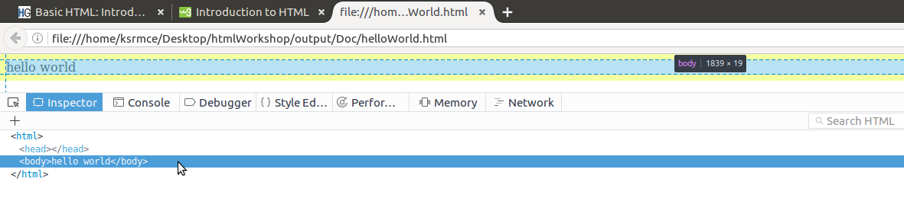

<pre>
This is the reference Document for HTML Workshop conducted in KSRM College Of Engineering
Author : Kunchala Anil
Email : anilkunchalaece@gmail.com
</pre>
<center> **HTML Introduction**</center>
What is HTML ? <br>
HTML [HYPER TEXT MARKUP LANGUAGE] is language for Specifying how text and graphics appear on the webpage
<br>

**Your First Webpage** <br>
<p>
Open your favourate Text editor and type <br>
```
Hello World
```
and save it as <em>helloWorld<strong>.html</strong></em> <br>
Dont forget the .html extension

and open the Doument with firefox or chrome. it will display something like This


Well.. eventhough browser able to render it without proper markup <br>
Before moving on we need to understand how browser understand input file
<br>
go to the developer console by **pressing F12**
then you can see something like This

