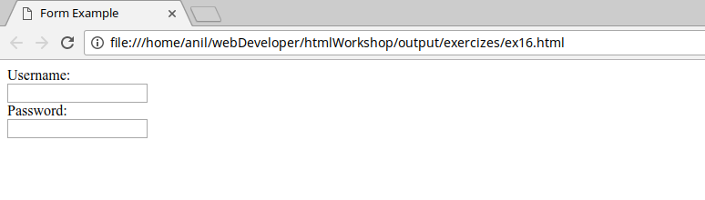
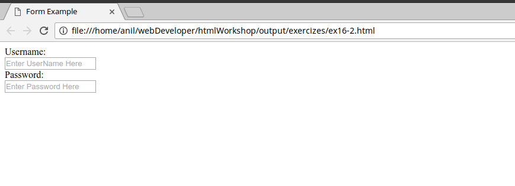
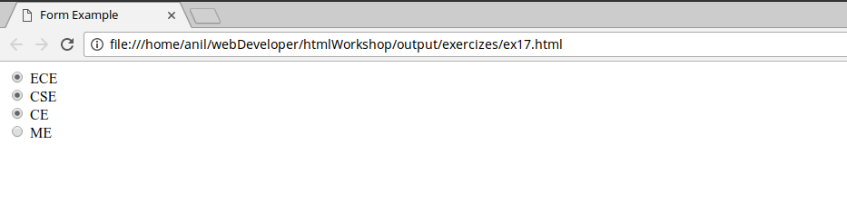
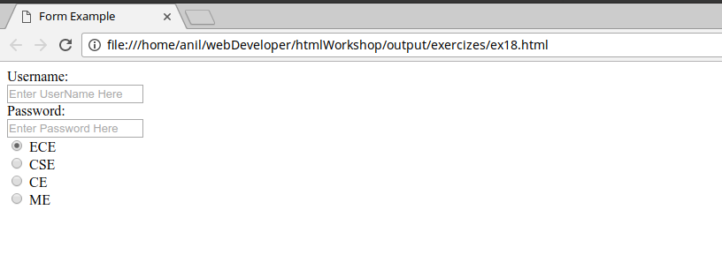
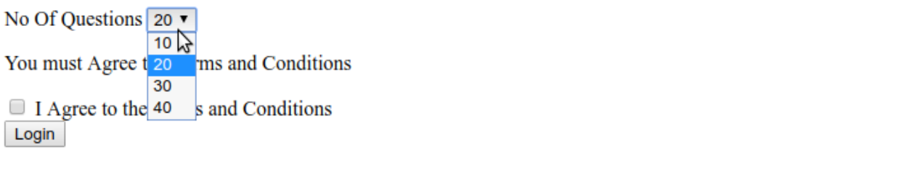
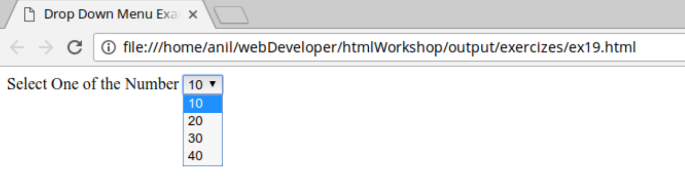
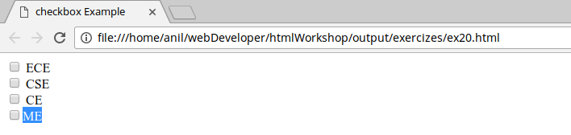
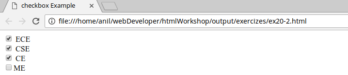
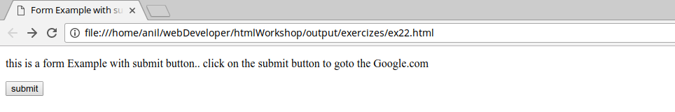
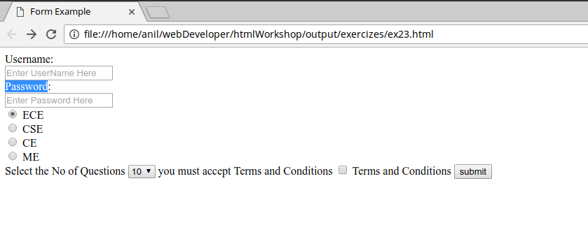

```
This is the reference Document for loginPage in HTML Workshop conducted in KSRM College Of Engineering
Author : Kunchala Anil
Email : anilkunchalaece@gmail.com
```
<p>
Login page is used to collect the user details using a html form element.
HTML Forms are one of the main points of interaction between a user and a web site or application.
They allow users to send data to the web site -*and we need to learn lot more to do that*
</p>

**Form Element**
--
All HTML forms start with a form element like this

```html
<form action="my-handling-Page">
.
form elements
.
</form>
```

<p>
An HTML form contains form elements.

Form elements are different types of input elements, like text fields, checkboxes, radio buttons, submit buttons, and more.<br>

*Input Element*<br>
The input element is the most important form element.
<br>
The input element can be displayed in several ways, depending on the type attribute.

Here are some examples:
</p>

```html
<input type="text">	Defines a one-line text input field
<input type="radio">	Defines a radio button (for selecting one of many choices)
<input type="submit">	Defines a submit button (for submitting the form)
```

**Text Input**
<br>
defines a one-line input field for text input:

```html

<form>
 Username:<br>
 <input type="text"><br>
 Password:<br>
 <input type="text">
</form>
```
output


<p>
To provide a short hint for user to describe the user with expected value of an
input fields we use placeholder attribute
</p>

```html
<form>
 Username:<br>
 <input type="text" placeholder="Enter Your UserName"><br>
 Password:<br>
 <input type="text" placeholder="Enter your Password">
</form>
```

Output

<p>
you can also use *value* attribute for the same purpose.. but it is used to pass the
user entered value which you came know in JavaScript tutorial.

</p>


**Radio Button Input**
<br>
Radio buttons let a user select ONE of a limited number of choices
<br>
```html
<!-- ex17.html -->
<form>
 <input type="radio"> ECE<br>
 <input type="radio"> CSE<br>
 <input type="radio"> CE<br>
 <input type="radio">ME<br>
</form>
```
Output

<p>
It all looks ok at the first glance.. if you try to select the options.. you can select
the all radio buttons available..
</p>

<p>
to to Restrict the user to select only one option in the set of radio buttons, we pass a *name* attribute to it.
</p>

```html
<!-- ex17-2.html -->
<form>
 <input type="radio" name="branch"> ECE<br>
 <input type="radio" name="branch"> CSE<br>
 <input type="radio" name="branch"> CE<br>
 <input typt="radio" name="branch">ME<br>
</form>
```
<p>
If you want any radio button is selected by default as shown in our Login Page you
can use attribute *checked*.
<br>
To select the Option ECE by default
</p>

```html
<form>
 <input type="radio" name="branch" checked="checked"> ECE<br>
 <input type="radio" name="branch"> CSE<br>
 <input type="radio" name="branch"> CE<br>
 <input typt="radio" name="branch">ME<br>
</form>
```
<p>
If you reload the page.. you can see that ECE option is checked.

Now add these functionalities to your code. and output will look like
</p>


and the code
</p>

```html
<!-- ex18.html -->
<!DOCTYPE html>
<html>

<head>
    <meta charset="utf-8">
    <title>Form Example</title>
</head>

<body>
  <form>
    Username:<br>
    <input type="text" placeholder="Enter UserName Here"><br>
    Password:<br>
    <input type="text" placeholder="Enter Password Here"><br>

   <input type="radio" name="branch" checked="checked"> ECE<br>
   <input type="radio" name="branch"> CSE<br>
   <input type="radio" name="branch"> CE<br>
   <input type="radio" name="branch"> ME<br>
 </form>
</body>

</html>
```
our Next Task is to design
<br>



It consist of two elements
1. Drop Down Menu Selection
2. Checkbox


 **Drop Down Menu Selection**
<p>
The _<select_> element is used to create a drop-down list.
 <br>
 The _<option_> tags inside the _<select_> element define the available options in the list.
</p>

```html
 <!--ex19.html-->
 <select>
  <option>10</option>
  <option>20</option>
  <option>30</option>
  <option>40</option>
 </select>
```

and the output will be

<p>
Like radio buttons if you want any option selected as default we can use attribute selected
</p>

```html
<!--ex19-2.html-->
<select>
 <option >10</option>
 <option>20</option>
 <option selected="selected">30</option>
 <option>40</option>
</select>

```
</p>

**CheckBox**
<p>
check box is another type of input element. It is more like radio button which allows the user to select a value from a small set of options but it allows the user to select multiple options
</p>

```html
<input type="checkbox"> ECE<br>
<input type="checkbox"> CSE<br>
<input type="checkbox"> CE<br>
<input type="checkbox">ME<br>
```
and the output



The Difference Between Radio Button and Checkbox is that, it will allow you to select multiple options

```html
<input type="checkbox" name="branch"> ECE<br>
<input type="checkbox" name="branch"> CSE<br>
<input type="checkbox" name="branch"> CE<br>
<input type="checkbox" name="branch">ME<br>
```
output <br>

</p>

**Action attribute**
<p>
In many cases, the purpose of an HTML Form is to send data to a server when submit button is pressed. But For now we are dealing only with Client Side.
<br>
action attribute defines where the data gets sent, its value must be valid URL.
<br>
in this example, the data is sent to the http://exampleForm.
</p>

```html
<form action="http://exampleForm.com">
or
<form action="formInSameServer.html">
```
<p>
To Invoke the Action Attribute we use input element with type submit
</p>

```html
<!-- Ex22 -->
<form action="http://google.com">
<input type="submit" value="submit">
</form>
```
output

<br>
Now add Both Checkbox and Drop Down Menu to your Login Page

it will look like


and the code for that
```html
!-- ex23.html -->
<!DOCTYPE html>
<html>

<head>
    <meta charset="utf-8">
    <title>Form Example</title>
</head>

<body>
  <form action="testPage.html">
    Username:<br>
    <input type="text" placeholder="Enter UserName Here"><br>
    Password:<br>
    <input type="text" placeholder="Enter Password Here"><br>

   <input type="radio" name="branch" checked="checked"> ECE<br>
   <input type="radio" name="branch"> CSE<br>
   <input type="radio" name="branch"> CE<br>
   <input type="radio" name="branch"> ME<br>

Select the No of Questions
   <select>
    <option>10</option>
    <option>20</option>
    <option>30</option>
    <option>40</option>
  </select>

   you must accept Terms and Conditions
   <input type="checkbox"> Terms and Conditions

   <input type="submit" value="submit">
 </form>
</body>

</html>
```
<p>
Now crete a simple html page to check whether action attribute for our form is working or not.
</p>

```html
<!-- testPage.html-->
<html>
  <head>
    <title>Simple Form Output</title>
  </head>
  <body>
    <p> Form Action Attribute is working </p>
  </body>
</html>
```

<p>
and save it as testPage.html in same directory and open the ex23.html with web browser and click the submit button of the form..
you should get to testPage.
<br>
Now user can submit the form without entering anything in the text inputs, we can inform the user to enter data in text inputs using *required* attribute
</p>

```html
<!-- ex24.html -->
  <form action="testPage.html">
    username<input type="text" required> <br>
    password<input type="text" required> <br>
    <input type="submit" value="submit">
  </form>
```

**Tables**
--
<p>
An HTML table is defined with the _<table_> tag. <br>

Each table row is defined with the _<tr_> tag. A table header is defined with the _<th_> tag. By default, table headings are bold and centered. A table data/cell is defined with the _<td_> tag.
</p>
```html
<!-- ex25.html-->
<table>
    <tr>
        <th>Firstname</th>
        <th>Lastname</th>
        <th>Age</th>
    </tr>
    <tr>
        <td>Jill</td>
        <td>Smith</td>
        <td>50</td>
    </tr>
    <tr>
        <td>Eve</td>
        <td>Jackson</td>
        <td>94</td>
    </tr>
</table>
```
Output


**THE END**
--
