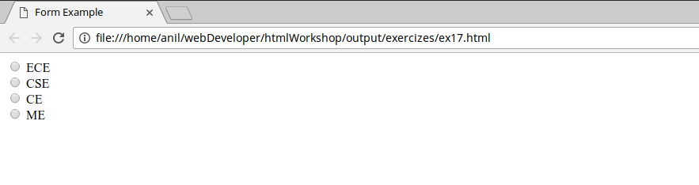

```
This is the reference Document for loginPage in HTML Workshop conducted in KSRM College Of Engineering
Author : Kunchala Anil
Email : anilkunchalaece@gmail.com
```
<p>
Login page is used to collect the user details using a html form element.
HTML Forms are one of the main points of interaction between a user and a web site or application.
They allow users to send data to the web site -*and we need to learn lot more to do that*
</p>

**Form Element**
--
All HTML forms start with a form element like this

```html
<form action="my-handling-Page">
.
form elements
.
</form>
```

<p>
An HTML form contains form elements.

Form elements are different types of input elements, like text fields, checkboxes, radio buttons, submit buttons, and more.<br>

*Input Element*<br>
The input element is the most important form element.
<br>
The input element can be displayed in several ways, depending on the type attribute.

Here are some examples:
</p>

```html
<input type="text">	Defines a one-line text input field
<input type="radio">	Defines a radio button (for selecting one of many choices)
<input type="submit">	Defines a submit button (for submitting the form)
```

**Text Input**
<br>
defines a one-line input field for text input:

```html

<form>
 Username:<br>
 <input type="text"><br>
 Password:<br>
 <input type="text">
</form>
```
output


<p>
To provide a short hint for user to describe the user with expected value of an
input fields we use placeholder attribute
</p>

```html
<form>
 Username:<br>
 <input type="text" placeholder="Enter Your UserName"><br>
 Password:<br>
 <input type="text" placeholder="Enter your Password">
</form>
```

Output

<p>
you can also use *value* attribute for the same purpose.. but it is used to pass the
user entered value which you came know in JavaScript tutorial.

</p>


**Radio Button Input**
<br>
Radio buttons let a user select ONE of a limited number of choices
<br>
```html
<!-- ex17.html -->
<form>
 <input type="radio"> ECE<br>
 <input type="radio"> CSE<br>
 <input type="radio"> CE<br>
 <input typt="radio">ME<br>
</form>
```
Output

<p>
It all looks ok at the first glance.. if you try to select the options.. you can select
the all radio buttons available..
</p>

<p>
to to Restrict the user to select only one option in the set of radio buttons, we pass a *name* attribute to it.
</p>

```html
<!-- ex17-2.html -->
<form>
 <input type="radio" name="branch"> ECE<br>
 <input type="radio" name="branch"> CSE<br>
 <input type="radio" name="branch"> CE<br>
 <input typt="radio" name="branch">ME<br>
</form>
```
<p>
If you want any radio button is selected by default as shown in our Login Page you
can use attribute *checked*.
<br>
To select the Option ECE by default
</p>

```html
<form>
 <input type="radio" name="branch" checked="checked"> ECE<br>
 <input type="radio" name="branch"> CSE<br>
 <input type="radio" name="branch"> CE<br>
 <input typt="radio" name="branch">ME<br>
</form>
```
<p>
If you reload the page.. you can see that ECE option is checked.

Now add these functionalities to your code. and output will look like
</p>


and the code
</p>

```html
<!-- ex18.html -->
<!DOCTYPE html>
<html>

<head>
    <meta charset="utf-8">
    <title>Form Example</title>
</head>

<body>
  <form>
    Username:<br>
    <input type="text" placeholder="Enter UserName Here"><br>
    Password:<br>
    <input type="text" placeholder="Enter Password Here"><br>

   <input type="radio" name="branch" checked="checked"> ECE<br>
   <input type="radio" name="branch"> CSE<br>
   <input type="radio" name="branch"> CE<br>
   <input type="radio" name="branch"> ME<br>
 </form>
</body>

</html>
```
our Next Task is to design
<br>


It consist of two elements
1. Drop Down Menu Selection
2. Checkbox

 **Drop Down Menu Selection**
 <p>
 The _<select_> element is used to create a drop-down list.
 </p>
